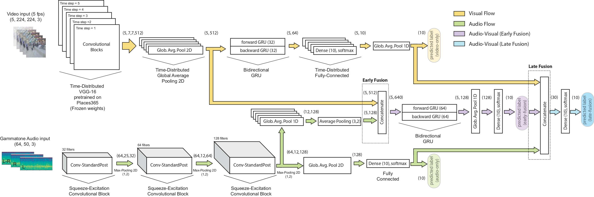
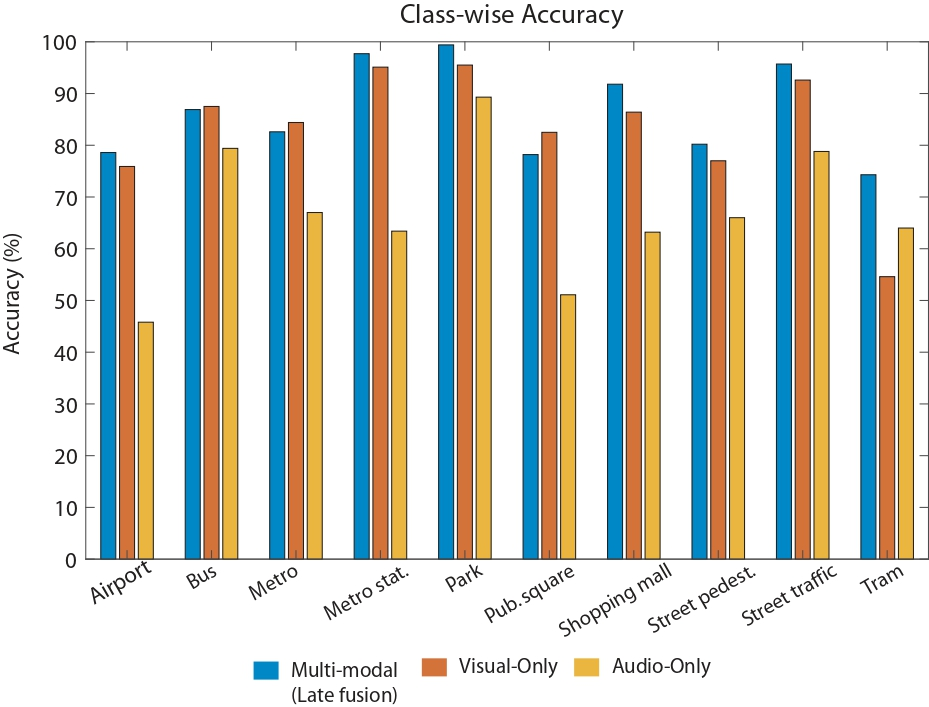

# DCASE2021-Task1b :rocket:

Audio-Visual Classifier in Acoustic Scene Clasification

Framework that uses video and audio data to predict a scene. The audio network uses squeeze-excitation techniques. The visual network is trained using a fine-tuning strategy with places365 checkpoint.

<p align="center">
  
</p>

## Steps

1. Train audio network
2. Train video network
3. Train full framework with forzen weights
4. Final fine-tuning

## Challenge comparison

7th position of the Challenge. Only 7 teams managed to obtain > 85%. Our framework consists of less parameters than framework in higher positions.

## Results

Development | Evaluation | 
--- | --- | 
90% | 86.5% | 

<p align="center">
  
</p>

## Citation

- [Paper](http://dcase.community/documents/workshop2021/proceedings/DCASE2021Workshop_Naranjo-Alcazar_11.pdf)
- [Poster](http://dcase.community/documents/workshop2021/posters/DCASE2021Workshop_Naranjo-Alcazar_11-poster.pdf)
- [Squeeze-Excitation paper](https://ieeexplore.ieee.org/stamp/stamp.jsp?arnumber=9118879)

```
@inproceedings{Naranjo-Alcazar2021,
    author = "Naranjo-Alcazar, Javier and Perez-Castanos, Sergi and Cobos, Maximo and Ferri, Francesc J. and Zuccarello, Pedro",
    title = "Squeeze-Excitation Convolutional Recurrent Neural Networks for Audio-Visual Scene Classification",
    booktitle = "Proceedings of the Detection and Classification of Acoustic Scenes and Events 2021 Workshop (DCASE2021)",
    address = "Barcelona, Spain",
    month = "November",
    year = "2021",
    pages = "16--20",
    abstract = "The use of multiple and semantically correlated sources can provide complementary information to each other that may not be evident when working with individual modalities on their own. In this context, multi-modal models can help producing more accurate and robust predictions in machine learning tasks where audio-visual data is available. This paper presents a multi-modal model for automatic scene classification that exploits simultaneously auditory and visual information. The proposed approach makes use of two separate networks which are respectively trained in isolation on audio and visual data, so that each network specializes in a given modality. The visual subnetwork is a pre-trained VGG16 model followed by a bidiretional recurrent layer, while the residual audio subnetwork is based on stacked squeeze-excitation convolutional blocks trained from scratch. After training each subnetwork, the fusion of information from the audio and visual streams is performed at two different stages. The early fusion stage combines features resulting from the last convolutional block of the respective subnetworks at different time steps to feed a bidirectional recurrent structure. The late fusion stage combines the output of the early fusion stage with the independent predictions provided by the two subnetworks, resulting in the final prediction. We evaluate the method using the recently published TAU Audio-Visual Urban Scenes 2021, which contains synchronized audio and video recordings from 12 European cities in 10 different scenes classes. The proposed model has been shown to provide an excellent trade-off between prediction performance (86.5\%) and system complexity (15M parameters) in the evaluation results of the DCASE 2021 Challenge."
}
```